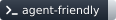
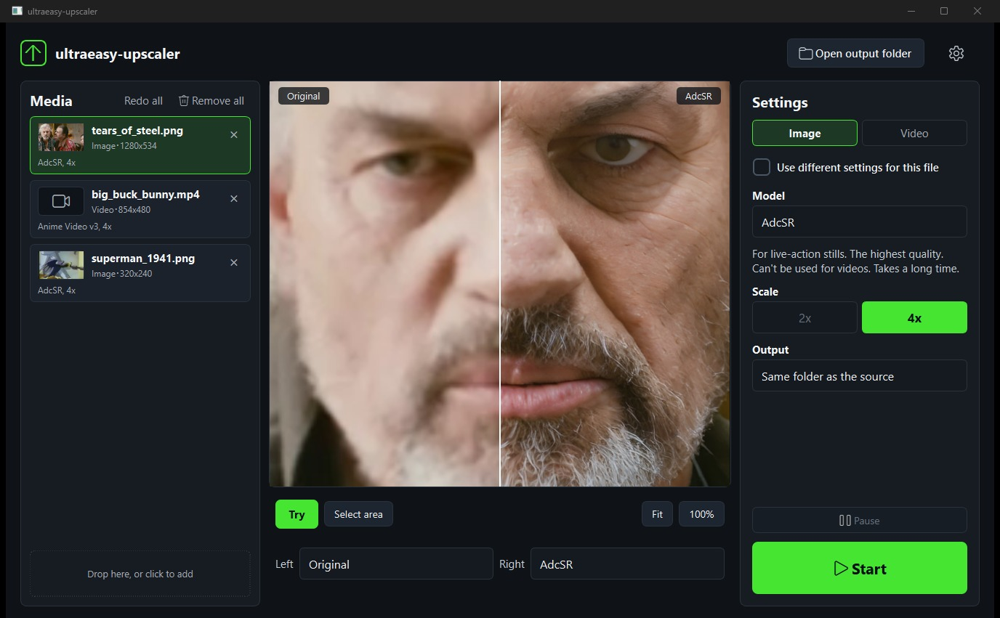
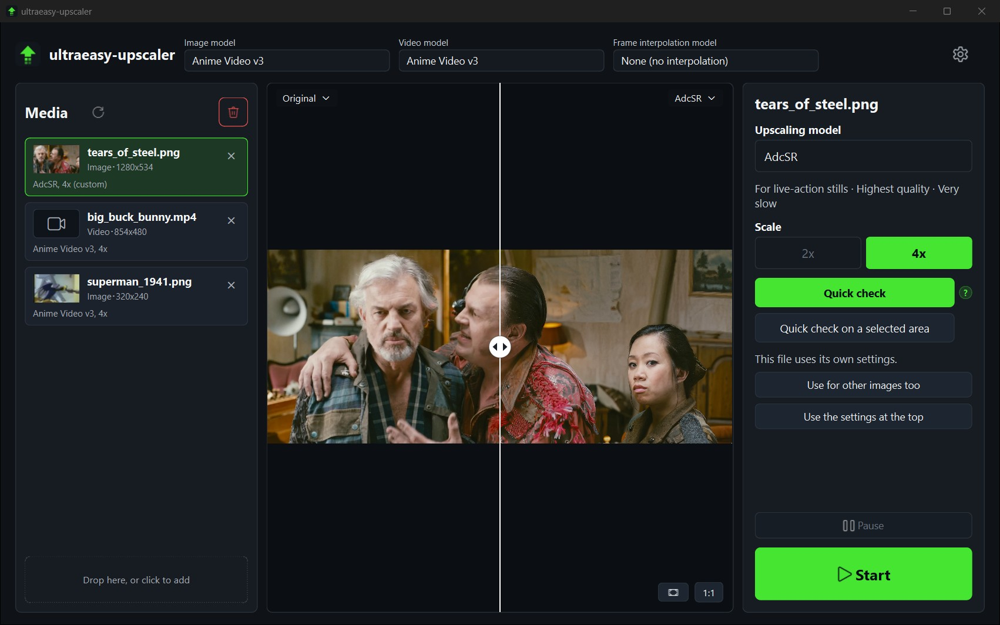
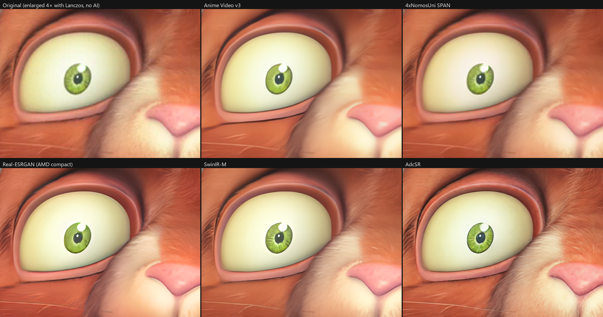
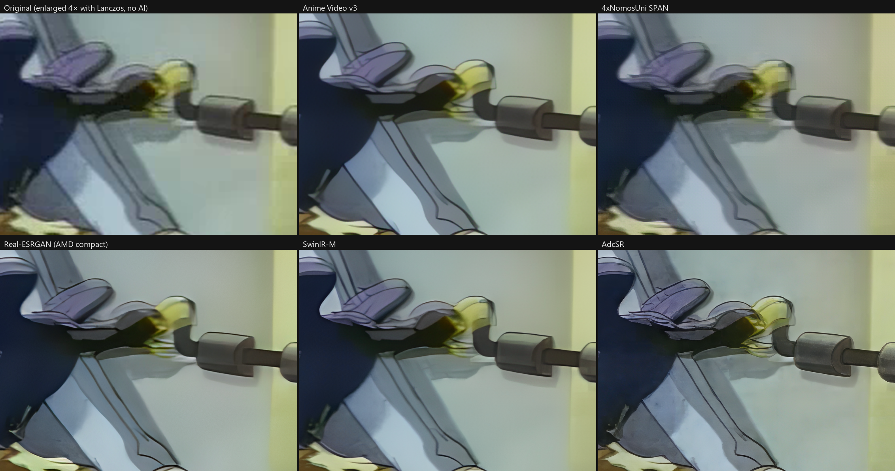
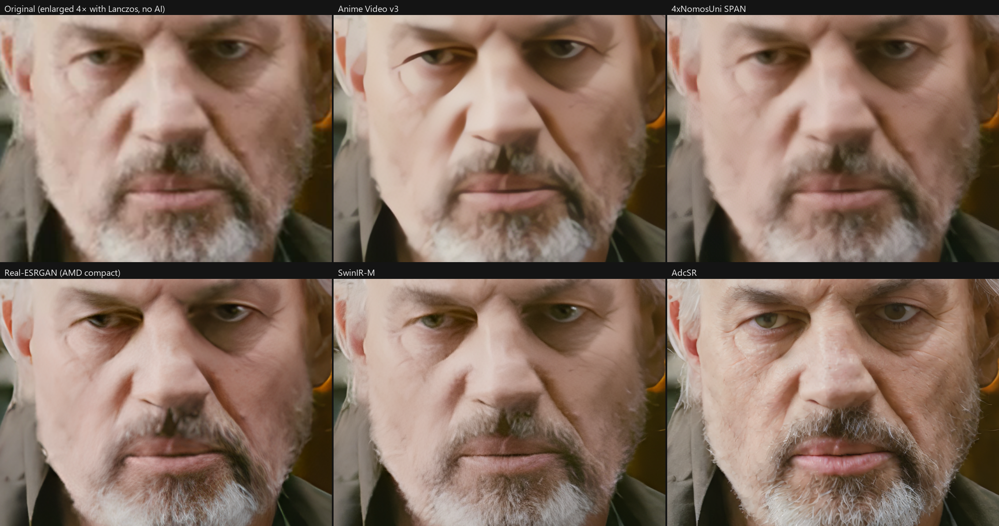
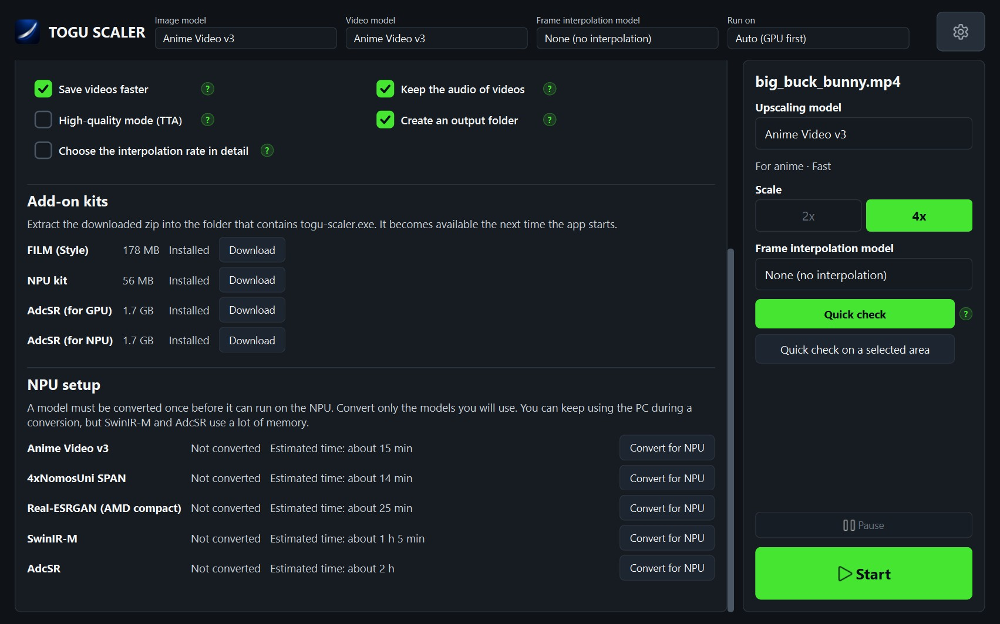

# TOGU SCALER

[日本語](README.md) [](AGENTS.md)

**[⬇ Download TOGU SCALER v0.12.1](https://github.com/tomhda/togu-scaler/releases/download/v0.12.1/togu-scaler-portable-win64.zip)**
(zip for Windows x64, 382 MB). See [Install](#install) for the steps.
Up to v0.11.0, the app was named ultraeasy-upscaler.

TOGU SCALER is a Windows app that upscales images and videos, and interpolates video frames, with a few clicks.
Everything runs on your own PC. It collects no data, shows no ads, and is open source.
It supports up to five super-resolution models, including Real-ESRGAN, and the frame interpolation models RIFE v4.6 and FILM (Style).
You can drop in many files and process them in one go. It runs on a GPU, and on the NPU of some PCs.
You can compare the results of several models side by side, and for a video you can process one chosen frame first to check the result.



## What it does

- Enlarges images and videos 4× with super-resolution models. Videos are saved as H.264.
- Super-resolution models: Anime Video v3, 4xNomosUni SPAN, Real-ESRGAN (AMD compact)\*, SwinIR-M, AdcSR\*

- Processing a video takes time, so before the full run you can pick one frame (or part of it), process just that, and compare it with the original. Results from different models can be compared with each other too.
- Processes a batch with the model you choose, and lets you use a different model for individual files.
- Runs on a DirectX 12 GPU. On AMD Ryzen AI PCs it can also run on the NPU once you add the NPU kit.

- Makes videos smoother with a frame interpolation model, on its own or together with upscaling.
- Frame interpolation models: RIFE v4.6, FILM (Style)\*

- Runs from the command line without opening the window, and returns its results as JSON ([Command line](#command-line)).

\* Real-ESRGAN (AMD compact) has a research-only license.
\* AdcSR is for still images only and is a separate download.
\* FILM (Style) is a separate download.

## Screenshots

▼ The main window. The models for all files are chosen at the top. The media list is on the left, the preview is in the middle, and the settings of the selected file are on the right.
The preview shows a photo after a quick check with AdcSR: the original is left of the divider and the result is right of it.



▼ The comparison can also be shown at 100%.


Material used:
[Big Buck Bunny](https://peach.blender.org) and [Tears of Steel](https://mango.blender.org) (both © Blender Foundation, CC BY 3.0),
and Superman (1941), which is in the public domain.

## Install

Tested on Windows 11 (x64) with a DirectX 12 GPU.

1. Download [`togu-scaler-portable-win64.zip`](https://github.com/tomhda/togu-scaler/releases/download/v0.12.1/togu-scaler-portable-win64.zip).
2. Extract the zip anywhere you like. It is a portable app and needs no installation.
3. Run `togu-scaler.exe`. The file is not code-signed, so Windows SmartScreen may show "Windows protected your PC". Select **More info**, then **Run anyway**.

The zip contains every file the app needs, so moving or deleting files inside the folder will very likely stop it from working.
To uninstall, delete the extracted folder.

## Use

### Add media

- Drag and drop files onto the window, or click the box at the bottom left to choose them.

### Choose a model

- **Image model**, **Video model**, and **Frame interpolation model** at the top choose the models used for all files.
- Select a file in the list to see its settings on the right. A change made there applies to that file only (its row shows **(custom)**).
- **Use for other videos too** (or **Use for other images too**) applies a file's own settings to all files, and **Use the settings at the top** removes them.
- See [Choosing a model](#choosing-a-model) for which one to pick.

### Quick check

- **Quick check** on the right enlarges just that one image in the same way as the full run and shows it next to the original.
- For a video, the slider under the preview chooses the frame to check. It starts at the 2-second mark.
- **Quick check on a selected area** processes only the part you drag over, so it finishes sooner.
- Change the model and check again to add another result. The labels at the top left and top right of the picture choose what to compare: the original, or the result of any model you have checked.
- Drag the handle in the middle of the divider to move it. The buttons at the bottom right switch between fitting the picture and 100%.

### Start

- **Start** processes the waiting files from the top. The output is saved in an `upscaled` folder next to the original file. (You can change this with **Output** in the settings.)
- **Pause** stops after the file being processed is finished.
- **×** on a row cancels that file right away.
- If a file with the same name already exists, the new file gets a number such as `(1)`.
- The folder button on a finished row opens the folder the file was saved in.

### Redo

- The round arrow on a finished row, or the round arrow above the list (Redo all), puts files back to waiting.

### Frame interpolation

- Choosing a **Frame interpolation model** doubles the frame rate of a video. It works together with upscaling or on its own.
- RIFE v4.6 is fast; FILM (Style) is slow and higher quality. Doubling a 3-second 854×480 video (72 frames) on a Radeon 860M took about 3 seconds with RIFE v4.6 and about 85 seconds with FILM (Style).
- Turning on **Choose the interpolation rate in detail** in the settings adds 4 times, 8 times, 60 fps, and 120 fps. FILM (Style) supports only 2, 4, or 8 times the source.
- FILM (Style) needs an [add-on kit](#add-on-kits).

### More settings

- The gear at the top right opens settings for where the AI runs, the file format, video quality, the output location, the output folder name, the display language, and more. It also shows which add-on kits are installed.
- The interface is available in English and Japanese. It starts in the Windows display language, and you can change it under **Display language** (the change takes effect the next time the app starts).
- **Accent color** changes the color used for highlights. It starts with the Windows accent color.

## Choosing a model

Times are for enlarging one 854×480 image 4× on a Radeon 860M (the integrated GPU of the Ryzen AI 7 PRO 350).

| Model | Best for | Time per image | Notes |
|---|---|---|---|
| Anime Video v3 | Anime, line art, CG | 0.46 s | Tidies details and smooths the picture. Good with old, degraded material. Looks heavily processed on live action |
| 4xNomosUni SPAN | Live action | 0.51 s | Keeps the original texture and grain. Its correction is mild, the original look remains, and it suits clean material |
| Real-ESRGAN (AMD compact) | Live action | 2.78 s | Brings out edges and individual hairs. Looks more processed. Research-only license |
| SwinIR-M | Live-action stills | 59 s | A transformer model. Takes its time and restores fine detail |
| AdcSR | Live-action stills | 108 s | A generative model that adds texture. It is very heavy and adds a lot, so it is for still images only. Not included in the app; it needs an [add-on kit](#add-on-kits) |

- If you are unsure, start with Anime Video v3 for anime and CG, and 4xNomosUni SPAN for live action.
- Setting **Run on** to Vulkan at the top of the window switches to a different engine (realesrgan-ncnn-vulkan). The model list changes to five Real-ESRGAN models, and Anime Video v3 can also enlarge 2×. If processing on the GPU cannot start, the app switches to this engine automatically.
- Models that need an add-on kit (AdcSR and FILM (Style)) are shown as "not installed" and cannot be chosen until the kit is added.

### Quality comparison

Results enlarged 4×.
Top row, left to right: the original (enlarged 4× with Lanczos, no AI), Anime Video v3, 4xNomosUni SPAN.
Bottom row, left to right: Real-ESRGAN (AMD compact), SwinIR-M, AdcSR.
All of them were run on the GPU with DirectML.

Toon CG: Big Buck Bunny (480p)



Cel animation: Superman (1941, 320×240)



Live action: Tears of Steel (720p)



- Anime Video v3: tidies details and smooths the picture. The strongest on old, degraded material.
- 4xNomosUni SPAN: keeps the original texture and grain. Its processing is mild, and the cleaner the source, the better it suits.
- Real-ESRGAN (AMD compact): brings out edges and each hair sharply. Looks more processed.
- SwinIR-M: tightens fine detail without breaking edges. Takes longer than 4xNomosUni SPAN.
- AdcSR: the AI draws in skin wrinkles, hair, and the weave of cloth. The most detailed on live action. On cel animation it also draws the roughness of the source as texture, so it is not suited to it.

## Add-on kits

Models that are not included in the app are separate downloads.

| Kit | Adds | File |
|---|---|---|
| FILM (Style) | The frame interpolation model FILM (Style) | [`togu-scaler-film-kit.zip`](https://github.com/tomhda/togu-scaler/releases/download/v0.12.1/togu-scaler-film-kit.zip) (178 MB) |
| AdcSR (for GPU) | The upscaling model AdcSR on the GPU | [`togu-scaler-adcsr-kit.zip`](https://github.com/tomhda/togu-scaler/releases/download/v0.12.1/togu-scaler-adcsr-kit.zip) (1.7 GB) |
| NPU kit | Processing on the NPU (below) | [`togu-scaler-npu-kit.zip`](https://github.com/tomhda/togu-scaler/releases/download/v0.12.1/togu-scaler-npu-kit.zip) (56 MB) |
| AdcSR (for NPU) | The upscaling model AdcSR on the NPU | [`togu-scaler-npu-kit-adcsr.zip`](https://github.com/tomhda/togu-scaler/releases/download/v0.12.1/togu-scaler-npu-kit-adcsr.zip) (1.7 GB) |

1. Close TOGU SCALER and extract the contents of the zip into the folder that contains `togu-scaler.exe`, overwriting files.
2. Start the app. The model is now in the list.

**Add-on kits** in the settings shows which kits are installed and downloads each zip. See the NOTICE file in each zip for the terms of use.

▼ **Add-on kits** and **NPU setup** in the settings



## NPU kit

On AMD Ryzen AI PCs, downloading an extra kit lets the app process on the NPU. The NPU becomes selectable when both of the following are in place.

- AMD's [Ryzen AI Software 1.8.0](https://ryzenai.docs.amd.com/en/latest/inst.html) (get it from AMD and install it; NPU driver 32.0.203.329 or later)
- [`togu-scaler-npu-kit.zip`](https://github.com/tomhda/togu-scaler/releases/download/v0.12.1/togu-scaler-npu-kit.zip) (56 MB)

To use AdcSR on the NPU, you also need the NPU-only model [`togu-scaler-npu-kit-adcsr.zip`](https://github.com/tomhda/togu-scaler/releases/download/v0.12.1/togu-scaler-npu-kit-adcsr.zip) (1.7 GB).

Steps:

1. Close TOGU SCALER and extract the contents of the kit zip into the folder that contains `togu-scaler.exe`, overwriting files.
2. Start the app, select the gear, and under **NPU setup** convert the models you will use for the NPU (select **Convert for NPU** on the model's row). The NPU cannot run a model as it is, so each model needs this once. The conversion is not heavy, but it holds some memory and takes from minutes to hours.
3. When the conversion for the NPU has finished, choose NPU under **Run on**.

Time and memory needed to convert a model for the NPU (measured on a Ryzen AI 7 PRO 350):

| Model | Time | Peak memory |
|---|---|---|
| Anime Video v3 | about 15 min | about 1.9 GB |
| 4xNomosUni SPAN | about 14 min | about 1.2 GB |
| Real-ESRGAN (AMD compact) | about 25 min | about 1.3 GB |
| SwinIR-M | about 65 min | about 25 GB |
| AdcSR | about 2 hours | not measured |

The conversion uses one CPU core, so it takes little CPU.
Converting SwinIR-M uses a lot of memory, so closing other apps first is recommended.
After you update the NPU driver or Ryzen AI Software, the conversion for the NPU may need to be done again.

Technical notes on running these models on the NPU (compiler workarounds, speedups, measurements) are in a separate repository:
[ryzen-ai-npu-super-resolution-notes](https://github.com/tomhda/ryzen-ai-npu-super-resolution-notes).

## Command line

`togu-scaler-cli.exe`, in the same folder as `togu-scaler.exe`, does the same processing without opening the window. It can print its results as JSON, so scripts and AI agents can use it.

```
togu-scaler-cli status --json
togu-scaler-cli models --json
togu-scaler-cli run photo.png --model 4xNomosUni --out-dir out --json
togu-scaler-cli run clip.mp4 --model none --interpolation rife-v4.6 --json
togu-scaler-cli quick-check clip.mp4 --time 5 --model animevideov3 --out check.png --json
```

- The value for `--model` is the `key` that `models --json` returns (`4xNomosUni` for 4xNomosUni SPAN, `animevideov3` for Anime Video v3).
- `run --dry-run` checks the settings and the output paths without processing.
- It never waits for input. Existing files are not overwritten unless `--overwrite` is given.
- Each error has a fixed name (`code`) and says what to do next (`fix`).

The list of commands, how to check a result, and the side effects are in [AGENTS.md](AGENTS.md).

## Limits

- The scale is 4× only. 2× is available for some models when **Run on** is set to Vulkan.
- Video output is at most 3840×2160. Larger results are reduced to that size.
- HDR video (PQ / HLG) can't be processed.
- AdcSR is for still images only.
- FILM (Style) interpolates only to 2, 4, or 8 times the source frame rate. Together with upscaling, it always interpolates first and upscales after.
- Settings such as the model return to their defaults when the app closes.
- The NPU can be used only on AMD Ryzen AI PCs that have Ryzen AI Software installed and the NPU kit added.

## Technical details

Running from source, the requirements of each engine, measurements, environment variables, the internal structure, and how the portable build is made are in
[docs/technical.md](https://github.com/tomhda/togu-scaler/blob/main/docs/technical.md) (in Japanese).

## License

- TOGU SCALER itself is under the [MIT License](LICENSE).
- Each model has its own license. Check it before use.

| Model | Author | License |
|---|---|---|
| Anime Video v3 (realesr-animevideov3) | xinntao ([Real-ESRGAN](https://github.com/xinntao/Real-ESRGAN)) | BSD 3-Clause |
| 4xNomosUni SPAN (4xNomosUni_span_multijpg) | Philip Hofmann (Phips) | CC BY 4.0 (attribution required) |
| Real-ESRGAN (AMD compact) | AMD | Research-only RAIL-MS (research use only) |
| SwinIR-M (003_realSR_BSRGAN_DFO_s64w8_SwinIR-M_x4_GAN) | Jingyun Liang | Apache 2.0 |
| AdcSR | Guaishou74851 (CVPR 2025) | Apache 2.0. The terms of use of Stable Diffusion 2.1-base, which it is built on (CreativeML Open RAIL++-M), also apply, so check them yourself before use |
| RIFE v4.6 | hzwer ([Practical-RIFE](https://github.com/hzwer/Practical-RIFE)) | MIT |
| FILM (Style) | Google Research ([FILM](https://github.com/google-research/frame-interpolation)); PyTorch port by dajes | Apache 2.0 |

- The portable build bundles FFmpeg (GPL v3), Qt 6 / PySide6 (LGPL v3), realesrgan-ncnn-vulkan (MIT), rife-ncnn-vulkan (MIT), the Microsoft Windows ML runtime, and others.
  The list and where to get each one are in `THIRD-PARTY-NOTICES.en.txt` in the zip, and the full texts of the model licenses are in the `models\ai` folder.
- Material in the screenshots and comparison images: [Big Buck Bunny](https://peach.blender.org) and [Tears of Steel](https://mango.blender.org) (© Blender Foundation, CC BY 3.0), and Superman (1941), which is in the public domain.
