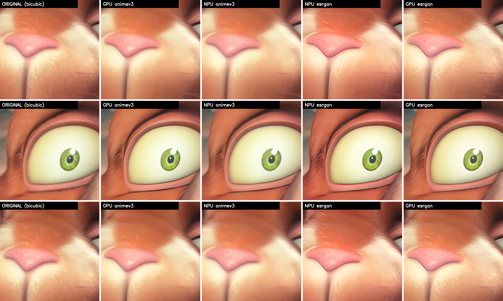
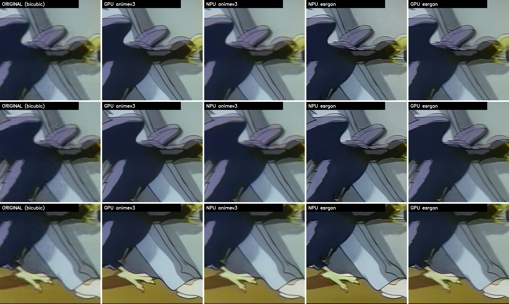
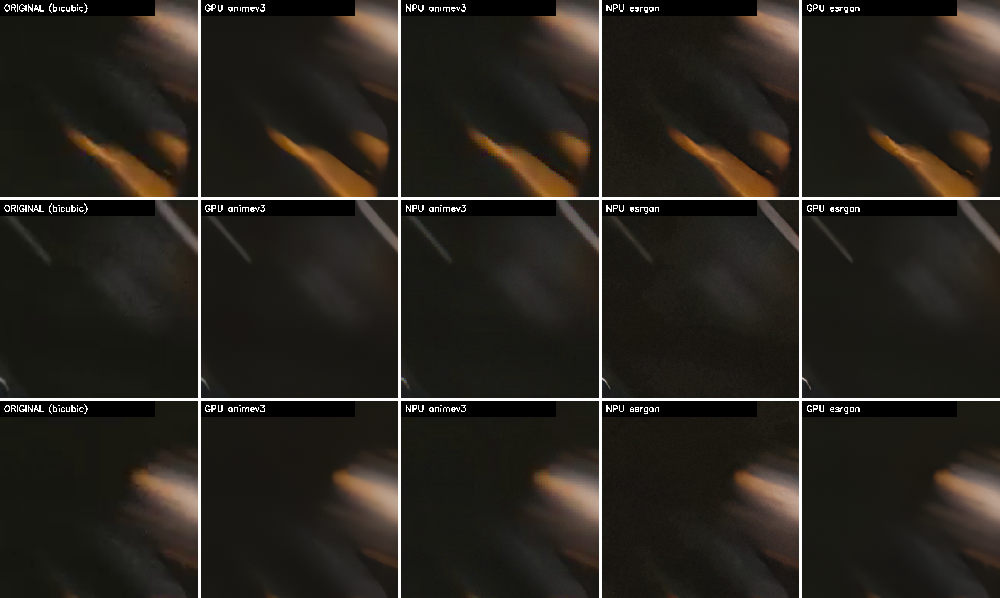

# ultraeasy-upscaler

real-esrgan-gui の不便を解消する、Windows ローカル専用の「かんたん神アプコン」ツール。

## 解決する課題
- **① D&D 非対応・複数枚はフォルダ指定のみ** → ドラッグ&ドロップ対応、複数ファイル/フォルダをキューに一括投入。
- **② 静止画のみ（動画は手動で 分解→拡大→結合）** → 動画を自動で **分解 → 拡大 → 再結合（音声維持）**。
- **③ NPU未活用** → Ryzen AI NPU（VitisAI EP）で画像 x4 アップスケールに対応。
- **④ フレーム補間なし** → RIFE v4.6で動画を2倍fpsまたは指定fpsへ補間。

## アーキテクチャ
- **GUI**: PySide6（ダークテーマ・ネイティブ D&D）。`app/gui`
- **コア（GUI 非依存・単体テスト可）**: `app/core`
  - `binaries.py` 外部バイナリ/モデル探索
  - `media.py` 種別判定・ffprobe メタ取得
  - `upscaler.py` realesrgan-ncnn-vulkan ラッパ（画像/フォルダ）
  - `npu_backend.py` / `npu_worker.py` Ryzen AI conda 環境経由の NPU ラッパ（画像/フォルダ）
  - `video.py` ffmpeg 抽出/再結合/HWエンコード
  - `interpolator.py` RIFE NCNN/Vulkan フレーム補間
  - `engine.py` ジョブのオーケストレーション
  - `jobs.py` / `settings.py` データモデル

## 必要物
- Python 3.13（同梱の `.venv` を使用）
- ffmpeg / ffprobe（PATH 上）
- `vendor/realesrgan/` に realesrgan-ncnn-vulkan 一式（exe + models）
- `vendor/rife/` に rife-ncnn-vulkan.exe + rife-v4.6

## NPU バックエンド
- **4x固定**。モデルは Real-ESRGAN（AMD公式int8）と Anime Video v3（自前量子化int8、
  `scripts/npu/` のパイプラインで作成）の2つから選べる。
- 画像（単枚/フォルダ）も動画のフレーム拡大もNPUで処理される。
- Ryzen AI Software 1.7.1 の conda 環境 `ryzen-ai-1.7.1` が必要。
- NPU モデルと VitisAI キャッシュは `vendor/amd-npu/` に配置済み（こちらは git 管理内）。
- 通常の GUI は `.venv` で起動し、NPU処理だけ `conda run -n ryzen-ai-1.7.1` のサブプロセスで実行する。
  - `vendor/realesrgan・rife・ffmpeg` は git 管理外。初回・再クローン時は `.venv\Scripts\python.exe scripts\get_models.py` で本体＋追加モデル（汎用動画モデル含む）を一括取得。

## 動画の処理
- 「アップスケーラーモデル」と「フレーム補間モデル」は独立して選択でき、双方に「なし」がある。
- アップスケールのみ、RIFE補間のみ、両方の3経路に対応。
- 両方を選んだ場合の順序は詳細設定「処理の順番」で選べる。既定は「アプコン→補間」
  （重いESRGANの対象フレーム数を補間前に抑えられるため速い）。高解像度出力で
  メモリが厳しい場合のみ「補間→アプコン」（省メモリ）を選ぶ。
- 動画は再生互換性を優先してH.264で出力し、元音声を維持する。
- **NPUバックエンドは4倍拡大固定**。NPU選択中はモデルコンボにNPU対応モデルだけが
  有効表示され、動画のフレーム拡大もNPUで処理される。
- 「一時停止」は現在のジョブ完了後に停止する（動画1本の途中では効かない）。
  実行中ジョブを今すぐ中止するにはキュー行の × を押す。
- 設定（モデル・倍率・出力先・詳細設定）は「開始」を押した時点のUI値が
  保留中の全ジョブへ一括適用される。追加時点の値は使われない。

## ベンチマークと画質比較（2026-08 実測）

実測環境: Ryzen AI 7 PRO 350（NPU: XDNA2）/ Radeon 860M（iGPU）/ 32GB LPDDR5。
いずれも →4x、1フレームあたりの実測値。

| 構成 | 480p | 720p | 特徴 |
|---|---|---|---|
| GPU + Anime Video v3 | 1.2秒 | 2.5秒 | 最速。アニメ調に強いが実写はのっぺり。GPUフル占有＝発熱大 |
| NPU + Real-ESRGAN (bf16) | 約1.5秒 | 約4秒 | GPU実行並みの画質でNPU最速。GPUフリーで他作業と並走可 |
| NPU + Real-ESRGAN Anime (bf16) | 約2.4秒 | 約6秒 | アニメ向け高画質。GPUフリー |
| NPU + Anime Video v3 (int8) | 約3秒 | 約9秒 | int8のギザギザが出やすく、NPUでは利点薄 |
| GPU + Real-ESRGAN | 17秒 | 47秒 | 最高画質だが動画には不向き |

### NPUの特性（実測からの知見）
- このNPUは**帯域律速で約4.2MP/s が上限**。モデルの軽さ（RRDB vs SRVGGNetCompact
  ≒演算量10倍差）でもタイルサイズ（256→512）でも速度はほぼ変わらない。
- 裏返すと「重い Real-ESRGAN がタダで使える」ため、NPUではモデルを画質だけで選べばよい。
- int8量子化（Quark XINT8 / u8s8）の劣化: fp32比でパッチPSNR平均38dB。目視では
  エッジのギザギザ（Anime Video v3 で顕著）としてあらわれる。

### 目視評

- アニメ/CG系は **GPU+Anime Video v3 が最良**。実写では Anime Video v3 系はのっぺりしやすい。
- Real-ESRGAN の GPU(fp16) と NPU(bf16) は目視でほぼ区別不能（差分35dB超）。
  実用上は同格で、速度と発熱で NPU が有利。

### 比較画像

列は左から: オリジナル(bicubic) / GPU+AnimeVideoV3 / NPU+AnimeVideoV3 / NPU+Real-ESRGAN / GPU+Real-ESRGAN。

トゥーンCG — Big Buck Bunny (480p):



セル画アニメ — Superman (1941, 320x240):



実写 — Tears of Steel (720p):



素材: [Big Buck Bunny](https://peach.blender.org) / [Tears of Steel](https://mango.blender.org)
© Blender Foundation (CC-BY 3.0)、Superman (1941) はパブリックドメイン。

## ポータブル版
PowerShellで次を実行すると、Python・ffmpeg・Real-ESRGAN・RIFE v4.6を同梱したzipを作成する。
```
powershell -ExecutionPolicy Bypass -File scripts\build_portable.ps1
```
展開後は `ultraeasy-upscaler.exe` をダブルクリックする。AMD Radeon / NVIDIA GeForce RTXはいずれもVulkan経路を使用する。

## 起動
`run.bat` をダブルクリック、または:
```
.venv\Scripts\python.exe -m app.main
```

## 開発
```
.venv\Scripts\python.exe -m pytest        # コアの単体テスト
```
