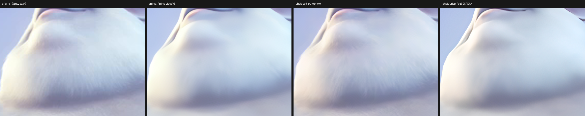
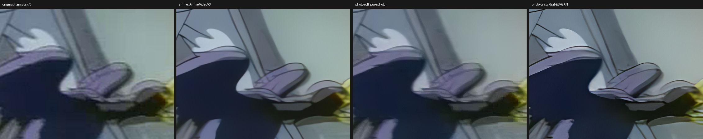
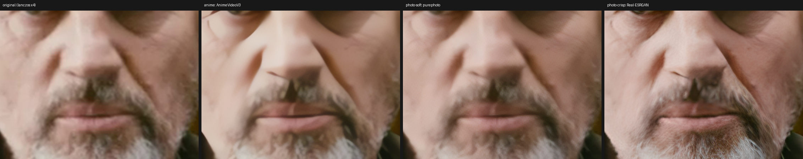

# ultraeasy-upscaler

Windows ローカル専用の、画像＆動画かんたんアップスケール＆フレーム補間ツール。

## アーキテクチャ
- **GUI**: PySide6（ダークテーマ・ネイティブ D&D）。`app/gui`
- **コア（GUI 非依存・単体テスト可）**: `app/core`
  - `binaries.py` 外部バイナリ/モデル探索
  - `media.py` 種別判定・ffprobe メタ取得
  - `upscaler.py` DirectML/NPU常駐ヘルパーと realesrgan-ncnn-vulkan の統合ラッパ（画像/フォルダ）
  - `helper_backend.py` / `serve_client.py` 新AIバックエンドのモデル解決・常駐セッション・バイナリプロトコル
  - `npu_backend.py` / `npu_worker.py` 旧NPU API（互換・スクリプト用に残置、GUIでは使用しない）
  - `video.py` ffmpeg 抽出/再結合/HWエンコード
  - `interpolator.py` RIFE NCNN/Vulkan フレーム補間
  - `engine.py` ジョブのオーケストレーション
  - `jobs.py` / `settings.py` データモデル
- **新AIヘルパー**: `tools/winml-sr/`（DirectML GPU、任意のWindows ML実行ファイル）と
  `tools/npu-serve/npu_serve.py`（Ryzen AI NPU）。どちらも常駐プロセスを使う。

## 必要物
- Python 3.13（同梱の `.venv` を使用）
- ffmpeg / ffprobe（PATH 上）
- `vendor/realesrgan/` に realesrgan-ncnn-vulkan 一式（exe + models）
- `vendor/rife/` に rife-ncnn-vulkan.exe + rife-v4.6
- DirectML GPU経路: `dotnet` 8 SDKで `tools/winml-sr` をビルド（任意。ビルド済みexeは配布しない）
- NPU経路: Ryzen AI Software 1.8.0相当のPython環境と対応するWindows ML/VitisAI EP（任意）

## 新AIバックエンド（DirectML / ネイティブNPU）

メインバーの「AI実行先」は次の4択。既定の「自動（GPU優先）」はDirectML GPUへ
正規化され、ヘルパー起動に失敗した画像・フォルダ・動画は既存のVulkanへフォールバックする。
新AIモデルは4x固定で、Vulkanを選んだ場合だけ従来のReal-ESRGANモデル一覧を表示する。

| AI実行先 | 実行方式 | 必要環境 | 備考 |
|---|---|---|---|
| 自動（GPU優先） | DirectML GPU | `tools/winml-sr` のビルド済みexe | GPUを優先。起動失敗時はVulkan |
| GPU（DirectML） | DirectML GPU | 同上 | 明示的にGPUを選択 |
| NPU | `npu_serve.py` + Ryzen AI | Ryzen AI 1.8.0相当のPython、EP | bf16cast、キャッシュ再利用 |
| Vulkan | realesrgan-ncnn-vulkan | `vendor/realesrgan` | 既存経路。2x/4x等の旧モデル |

新AIの「モデル」は3系統で、GPU/NPUで対応するONNX名とタイルが異なる。

| GUIの系統 | 主モデル | 用途 | 既定タイル |
|---|---|---|---:|
| アニメ | animevideov3系 | アニメ・線画・CG | GPUは256/512自動、NPUは512 |
| 実写（質感重視） | purephoto = 4xNomosUni_span_multijpg | 実写の自然な質感 | GPUは256/512自動、NPUは512 |
| 実写（くっきり） | Real-ESRGAN | 輪郭を強めたい実写 | 256 |

### パス設定（環境変数で上書き可能）

| 環境変数 | 既定値 | 用途 |
|---|---|---|
| `UEU_WINML_HELPER` | `tools/winml-sr/bin/Release/net*/win-x64/winml-sr.exe` の自動探索 | WinMLヘルパーの明示指定 |
| `UEU_MODELS_DIR` | `tmp/npu-anime` | GPU fp32 / SPANモデルの探索先 |
| `UEU_NPU_PYTHON` | `%USERPROFILE%\miniforge3\envs\ryzen-ai-1.8.0\python.exe` | NPU常駐サーバーを起動するPython |
| `UEU_NPU_CACHE` | `vendor/amd-npu-1.8` | NPU EPのセッションキャッシュ |

機械固有の絶対パスはソースへ埋め込まない。重み・ONNX・NPUキャッシュは新規にgitへ
追加しない。取得と変換は次の手順で行う。

```powershell
.venv\Scripts\python.exe scripts\get_ai_models.py --list
.venv\Scripts\python.exe scripts\get_ai_models.py --download purephoto
.venv\Scripts\python.exe scripts\get_ai_models.py --pipeline purephoto --tile 512
```

`get_ai_models.py` は重みURLとSHA-256を検証し、`scripts/npu/export_spandrel.py` による
固定形状fp32 ONNX化と、Ryzen AI環境での次のbf16cast変換コマンドを表示する。

```text
python -m quark.onnx.tools.convert_fp32_to_bf16 \
  --input <fp32.onnx> --output <bf16cast.onnx> --format with_cast
```

既存のVulkan/RIFE資材は従来どおり次で取得する。

```powershell
.venv\Scripts\python.exe scripts\get_models.py
```

## 動画の処理
- 「アップスケーラーモデル」と「フレーム補間モデル」は独立して選択でき、双方に「なし」がある。
- アップスケールのみ、RIFE補間のみ、両方の3経路に対応。
- 両方を選んだ場合の順序は詳細設定「処理の順番」で選べる。既定は「アプコン→補間」
  （重いESRGANの対象フレーム数を補間前に抑えられるため速い）。高解像度出力で
  メモリが厳しい場合のみ「補間→アプコン」（省メモリ）を選ぶ。
- 動画は再生互換性を優先してH.264で出力し、元音声を維持する。
- **RIFE補間が有効な動画は従来のPNGフレーム経路を使う**。補間をフレームファイルへ
  渡す必要があるためで、フレーム拡大だけは新AIの常駐セッションを使い回せる。
- **RIFEなし・新AIの動画はrawvideo 3スレッドパイプライン**（ffmpegデコード→AI推論→
  ffmpegエンコード）を使い、PNGの中間書き出しを省略する。音声はAACで保持する。
- 新AIバックエンドは4倍拡大固定。NPUの短辺480px未満入力は安全のためGPUへ自動切替する。
- 「一時停止」は現在のジョブ完了後に停止する（動画1本の途中では効かない）。
  実行中ジョブを今すぐ中止するにはキュー行の × を押す。
- 設定（モデル・倍率・出力先・詳細設定）は「開始」を押した時点のUI値が
  保留中の全ジョブへ一括適用される。追加時点の値は使われない。

## モデル選択ガイド（新AI）

| 目的 | AI実行先 | モデル系統 |
|---|---|---|
| アニメ・線画・CGを自然に拡大 | 自動 / GPU | アニメ（animevideov3系） |
| 実写の毛・肌・背景の質感を残す | 自動 / GPU | 実写（質感重視）（purephoto） |
| 実写の輪郭を強く見せる | 自動 / GPU | 実写（くっきり）（Real-ESRGAN） |
| GPUを他の作業へ空ける | NPU | 上記3系統。アニメ/質感系は512、Real-ESRGANは256 |
| 既存モデル・2x等を使う | Vulkan | Vulkan選択時の従来モデル一覧 |

新AIを試す場合は「自動（GPU優先）」から始める。ヘルパーが無い環境でも、
画像・フォルダはVulkanへ退避する。NPUはRyzen AI環境とEPが必要で、初回だけ
モデルごとのコンパイル時間が発生する。実写の質感重視系は
`4xNomosUni_span_multijpg`（purephoto）を使う。

purephotoの帰属表示: **4xNomosUni_span_multijpg — CC-BY-4.0, by Philip Hofmann/Phips**。
取得元とSHA-256は [docs/span-bench-results.md](docs/span-bench-results.md) に記録している。

## 実測ベンチマーク（現行構成）

実測環境: AMD Ryzen AI 7 PRO 350（NPU: XDNA2 / ドライバ 32.0.203.329）・
Radeon 860M（iGPU）・32GB LPDDR5-8000。入力 854x480 → 4倍（3416x1920）。
数値はタイル分割・結合・色変換込みの「1枚あたり」実測（常駐セッションの定常値、
ベストエフォート3回の最良値）。GPUは fp32 ONNX を DirectML で、NPUは bf16cast を
Ryzen AI SW 1.8.0 の VitisAI EP（VAIMLコンパイル）で実行。

| モデル系統 | 実体モデル | アーキテクチャ | GPU (DirectML, fp32) | NPU (VitisAI, bf16) | タイル (GPU/NPU) | NPU bf16忠実度* |
|---|---|---|---|---|---|---|
| アニメ | realesr-animevideov3（NPUはPReLU分解版 `dp`） | SRVGGNetCompact | **0.46秒** | 1.14秒 | 256〜512自動 / 512 | 48.3 dB |
| 実写（質感重視） | `4xNomosUni_span_multijpg`（purephoto） | SPAN（48nf） | 0.51秒 | **0.60秒** | 256〜512自動 / 512 | 43.1 dB |
| 実写（くっきり） | Real-ESRGAN（AMD縮小RRDB版） | RRDB | 2.78秒 | 2.15秒 | 256 / 256 | 37.9 dB** |

\* 同一モデルの fp32 出力との PSNR。40dB前後は目視でほぼ判別不能の水準。
\*\* Real-ESRGAN の忠実度は Ryzen AI 1.7.1 時点の測定値（1.8.0 では速度のみ再測定）。

動画（rawvideoパイプライン・音声保持・3秒クリップのE2E実測）:

| 経路 | 実効fps | 1フレームあたり |
|---|---|---|
| GPU (DirectML) × アニメ | **2.48fps** | 0.40秒 |
| NPU (VitisAI) × アニメ | 0.83fps | 1.21秒 |

動画の1フレーム値が静止画定常値より速い（GPU 0.40 vs 0.46秒）のは、
パイプラインがデコード/変換と推論を重ねて隠すため。NPU動画はGPU使用率ほぼゼロの
まま回るので、ゲーム・GPU作業と並走できる。

補足:

- NPUは初回のみモデル毎にVAIMLコンパイルが走る（実測: av3dp 512 = 15.2分 /
  purephoto 512 = 12.9分 / Real-ESRGAN 256 = 18.7分）。以後はキャッシュから数秒で起動
- NPUの純推論はタイル処理を除くと av3dp 512 で 1.03秒/枚（Python側前後処理が約0.12秒）
- Vulkan経路（realesrgan-ncnn-vulkan・フォールバック兼用）: animevideov3 実効約0.7秒/枚

## モデル系統の画質比較

列は左から（すべて GPU/DirectML・fp32 で実行）:

1. オリジナル（lanczos 4x・AIなし）
2. アニメ = **realesr-animevideov3**（SRVGGNetCompact）
3. 実写（質感重視）= **4xNomosUni_span_multijpg**（SPAN, purephoto）
4. 実写（くっきり）= **Real-ESRGAN**（AMD縮小RRDB版）

トゥーンCG — Big Buck Bunny (480p):



セル画アニメ — Superman (1941, 320x240):



実写 — Tears of Steel (720p):



傾向:

- **アニメ = realesr-animevideov3**: 細部を整理してなめらかに。劣化した古い素材に最も強い
- **実写（質感重視）= 4xNomosUni_span_multijpg**: 原本の質感・粒状感を尊重する忠実系。綺麗なソースで真価
- **実写（くっきり）= Real-ESRGAN**: 輪郭や毛の1本1本を立てる知覚系。加工感は強め

素材: [Big Buck Bunny](https://peach.blender.org) / [Tears of Steel](https://mango.blender.org)
© Blender Foundation (CC-BY 3.0)、Superman (1941) はパブリックドメイン。

過去の測定履歴（旧Vulkan/旧Ryzen AI経路、int8/bf16検証、NPU特性の調査記録）は
[docs/npu-research.md](docs/npu-research.md) と
[docs/span-bench-results.md](docs/span-bench-results.md) を参照。

## ポータブル版
PowerShellで次を実行すると、Python・ffmpeg・Real-ESRGAN・RIFE v4.6を同梱したzipを作成する。
```
powershell -ExecutionPolicy Bypass -File scripts\build_portable.ps1
```
展開後は `ultraeasy-upscaler.exe` をダブルクリックする。AMD Radeon / NVIDIA GeForce RTXはいずれもVulkan経路を使用する。

## 起動
`run.bat` をダブルクリック、または:
```
.venv\Scripts\python.exe -m app.main
```

## 開発
```
.venv\Scripts\python.exe -m pytest        # コアの単体テスト
```

## ライセンス

- 本リポジトリのコード: [MIT](LICENSE)
- `vendor/amd-npu/` の Real-ESRGAN NPUモデル: AMD公式モデル由来のため
  [Research-only RAIL-MS](vendor/amd-npu/LICENSE)（研究用途限定）
- その他のNPUモデル（Anime Video v3 / Real-ESRGAN Anime）: BSD-3-Clause の
  [xinntao/Real-ESRGAN](https://github.com/xinntao/Real-ESRGAN) 重みから変換
- purephoto（`4xNomosUni_span_multijpg`）: **CC-BY-4.0**, by **Philip Hofmann/Phips**
- ベンチマーク画像の素材: Big Buck Bunny / Tears of Steel
  （© Blender Foundation, CC-BY 3.0）、Superman (1941) はパブリックドメイン
