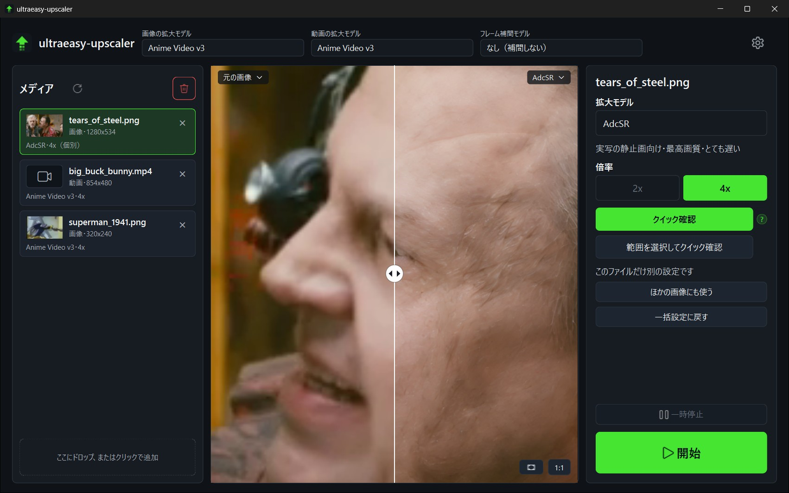
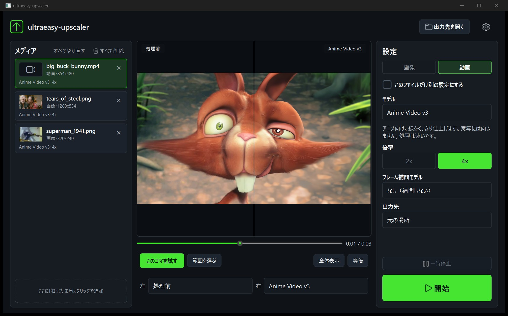
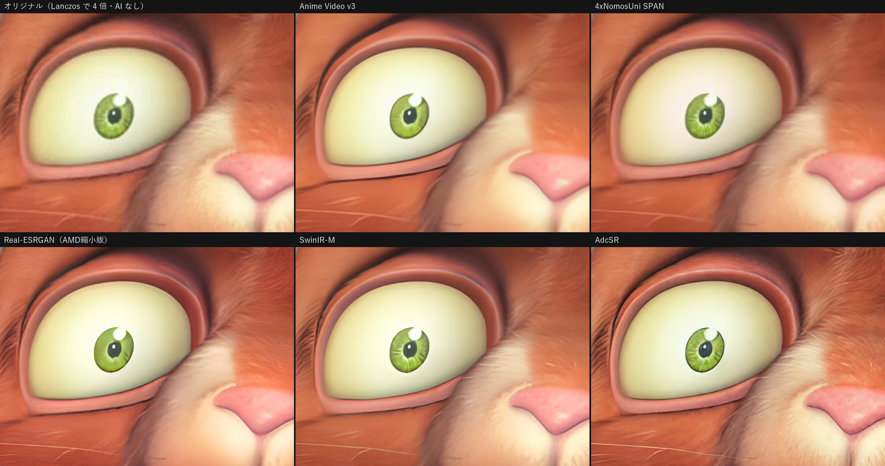
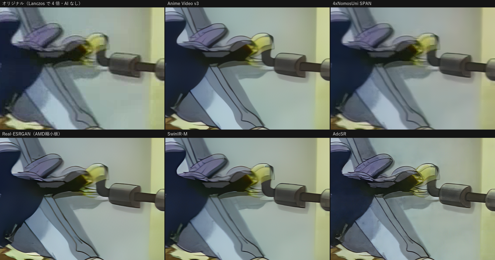
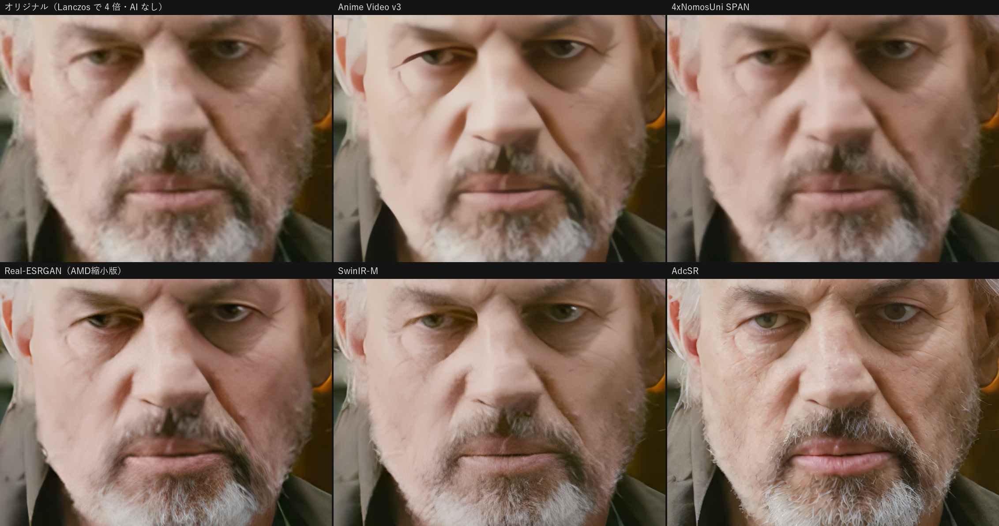
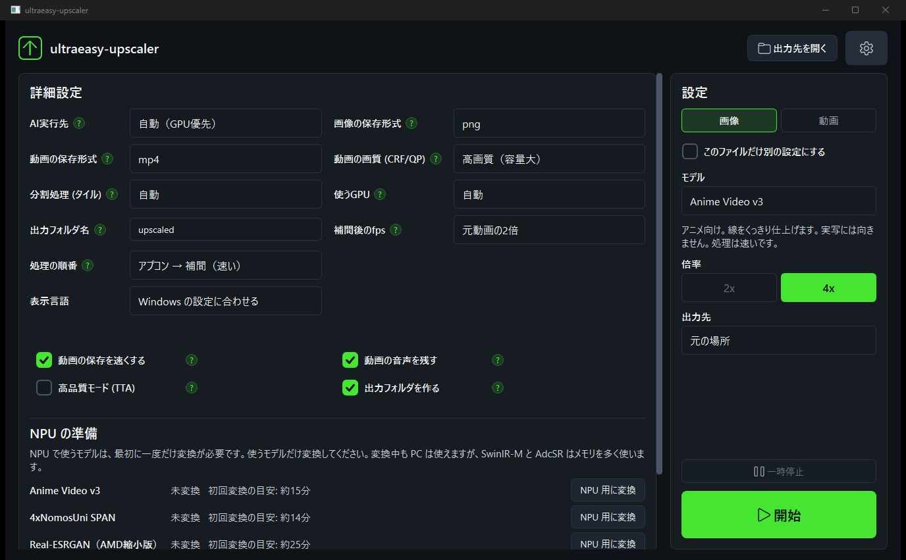

# TOGU SCALER

[English](README.en.md) [](AGENTS.md)

**[⬇ TOGU SCALER v0.12.0 をダウンロード](https://github.com/tomhda/togu-scaler/releases/download/v0.12.0/togu-scaler-portable-win64.zip)**
（Windows x64 用の zip、382 MB）。手順は「[導入](#導入)」を参照。
v0.11.0 までの名前は ultraeasy-upscaler です。

TOGU SCALER は、画像や動画を かんたん操作でアップスケール/フレーム補間ができる Windows 用のアプリです。
処理は全てローカルで動作し、情報収集なし、広告なし・オープンソースです。
Real-ESRGAN など、最大5つの超解像モデルと、RIFE v4.6・FILM (Style) のフレーム補間モデルに対応しています。
ドラッグ＆ドロップでの一括変換に対応。GPU/一部NPU 対応。
複数のモデルでの処理結果を見比べたり、動画の場合は先に指定の 1 コマだけを処理して確認することもできます。



## できること

- 超解像モデルを用いて画像、動画を キレイに拡大。動画はH.264 で保存。
- 超解像モデル：Anime Video v3、 4xNomosUni SPAN、Real-ESRGAN（AMD縮小版）※、SwinIR-M、AdcSR※

- 動画処理は時間がかかるため、本処理の前に 1 コマ（またはその一部）を選んで処理し、処理前と見比べることができます。複数のモデル同士も比較可能です。
- モデルを指定して一括処理の他、特定のファイルだけ別のモデルで処理することも可能。
- DirectX 12 対応GPUで動作。AMD Ryzen AI 搭載機では、追加の拡張キットを入れると NPU でも動作可能。

- フレーム補間モデルを用いて、動画をなめらかにすることができます。超解像との組み合わせ実行も可能。
- フレーム補間モデル：RIFE v4.6、FILM (Style)※

- 画面を開かずにコマンドから実行でき、結果を JSON で受け取れます（[コマンドライン](#コマンドライン)）。

※Real-ESRGAN（AMD縮小版）は研究用途限定のライセンス
※AdcSRは静止画専用・別途ダウンロード必須
※FILM (Style) は別途ダウンロード必須

## 画面

▼ 動作画面。上で全体のモデルを選び、左がメディアの一覧、中央がプレビュー、右が選んだファイルの設定です。
中央は写真を AdcSR でクイック確認した後の状態で、境界線の左右で処理前後を比較できます。



▼ 等倍での比較表示も可能


使用素材：
[Big Buck Bunny](https://peach.blender.org)、[Tears of Steel](https://mango.blender.org)（どちらも © Blender Foundation, CC BY 3.0）
Superman (1941)（パブリックドメイン）

## 導入

Windows 11（x64）と、DirectX 12 対応の GPU で動作確認済み

1. [`togu-scaler-portable-win64.zip`](https://github.com/tomhda/togu-scaler/releases/download/v0.12.0/togu-scaler-portable-win64.zip) をダウンロード
2. zip を好きな場所に展開（ポータブル版のためインストール不要）。
3. `togu-scaler.exe` を起動。署名のない実行ファイルなので、Windows の SmartScreen が「Windows によって PC が保護されました」と表示することがある。その場合は「詳細情報」→「実行」。

zip には動作に必要な全ファイルが入っているため、フォルダの中のファイルを移動・削除すると動作しなくなる可能性が非常に高いです。
アンインストールは展開フォルダごと削除ください。

## 使い方

### メディア追加

- ドラッグ＆ドロップまたは左下の枠をクリックしてメディアを追加します。

### モデル選択

- 画面の上にある「画像の拡大モデル」「動画の拡大モデル」「フレーム補間モデル」で、全体に使うモデルを選びます。
- 一覧でファイルを選ぶと、右側にそのファイルの設定が出ます。ここで変えると、そのファイルだけ別の設定で処理可能です（一覧の行に「（個別）」と出ます）。
- 個別の設定は「ほかの動画にも使う」（画像なら「ほかの画像にも使う」）で全体に広げたり、「一括設定に戻す」で取り消したりできます。
- どれを選ぶかは「[モデルの選び方](#モデルの選び方)」を参照。

### クイック確認

- 右側の「クイック確認」を押すと、その 1 枚だけを本処理と同じ方法で拡大し、元の画像と並べて比較できます。
- 動画は、プレビューの下のスライダーで確認するフレームを選択可能です。デフォルトは開始 2 秒地点。
- 「範囲を選択してクイック確認」では、囲んだ部分だけを処理するので早く終わります。
- モデルを変えてもう一度確認すると、比較できる結果が増えていきます。画像の左上・右上の札を押すと、元の画像と各モデルの結果から比べる相手を選択可能
- 境界線は中央のつまみを左右に動かせます。右下のボタンで全体表示と等倍を切り替えます。

### 開始

- 「開始」を押すと、待機中のファイルを上から順に処理します。出力は元のファイルと同じ場所の `upscaled` フォルダに保存。（詳細設定の「出力先」で変更可能）
- 「一時停止」は、処理中のファイルが終わってから停止するボタンです。
- 「 × 」今すぐ処理を中止します。
- 処理後の同ファイル名が同名になる場合は`(1)` のように番号付きで保存されます。
- 終わった行のフォルダのボタンで、保存先を開けます。

### やり直す

- 終わった行の丸い矢印、または一覧の上の丸い矢印（すべてやり直す）で処理前に戻します。

### フレーム補間

- 「フレーム補間モデル」を選ぶと、動画のフレームレートを元の 2 倍にします。拡大と一緒にも、補間だけでも使えます。
- RIFE v4.6 は高速、FILM (Style) は低速・高品質です。854×480・3 秒（72 フレーム）の動画を 2 倍にしたとき、Radeon 860M で RIFE v4.6 は約 3 秒、FILM (Style) は約 85 秒でした。
- 詳細設定の「補間の倍率を細かく選ぶ」を入れると、4 倍・8 倍や 60 fps・120 fps を選べます。FILM (Style) は元の 2 倍・4 倍・8 倍のみです。
- FILM (Style) は「[追加キット](#追加キット)」が必要です。

### 詳細設定

- 右上の歯車を押すと、AI の実行先、保存形式、動画の画質、出力先、出力フォルダ名、表示言語などが変更可能です。追加キットの導入状態もここで確認できます。
- 画面は日本語と英語に対応しています。最初は Windows の表示言語に合わせて決まり、「表示言語」で変更できます（次回の起動から切り替わります）。
- 「アクセントカラー」で、画面の強調に使う色を変えられます。最初は Windows のアクセント カラーに合わせます。

## モデルの選び方

時間は Radeon 860M（Ryzen AI 7 PRO 350 の内蔵 GPU）で 854×480 の 1 枚を 4 倍にしたときの値。

| モデル | 向いているもの | 1 枚の時間 | 補足 |
|---|---|---|---|
| Anime Video v3 | アニメ・線画・CG | 0.46 秒 | 細部を整理してなめらかにする。劣化した古い素材に強い。実写には加工感が強く出る |
| 4xNomosUni SPAN | 実写 | 0.51 秒 | 元の質感や粒状感を残す実写向きの素材。補正は強くないが元の雰囲気が残り、きれいな素材に向く |
| Real-ESRGAN（AMD縮小版） | 実写 | 2.78 秒 | 輪郭や毛を 1 本ずつ立てる。加工感は強め。研究用途限定のライセンス |
| SwinIR-M | 実写の静止画 | 59 秒 | Transformerモデル。時間をかけて細部まで復元。 |
| AdcSR | 実写の静止画 | 108 秒 | AI生成型で、質感を作り足すモデル。とても重く書き足しも強いため静止画専用。本体には含まれず[追加キット](#追加キット)が必要 |

- 迷ったら、アニメ・CG は Anime Video v3、実写は 4xNomosUni SPAN がオススメ
- 画面の上の「AI実行先」を Vulkan にすると、別の方式（realesrgan-ncnn-vulkan）で処理します。選べるモデルが Real-ESRGAN 系の 5 種類に変わり、Anime Video v3 では 2 倍の拡大も選べます。GPU での処理を開始できなかった場合は、自動でこの方式に切り替わります。
- 追加キットが必要なモデル（AdcSR、FILM (Style)）は、キットを入れるまで「（未導入）」と表示され、選べません。

### 画質の比較

4倍への拡大結果
上段は左から オリジナル（Lanczos で 4 倍・AI なし）、Anime Video v3、4xNomosUni SPAN。
下段は左から Real-ESRGAN（AMD縮小版）、SwinIR-M、AdcSR。
すべて GPU / DirectML で実行。

トゥーン CG — Big Buck Bunny (480p):



セル画アニメ — Superman (1941, 320x240):



実写 — Tears of Steel (720p):



- Anime Video v3: 細部を整理してなめらかに。劣化した古い素材に最も強い
- 4xNomosUni SPAN: 元の質感や粒状感を残す。加工は控えめで、きれいな素材ほど向く
- Real-ESRGAN（AMD縮小版）: 輪郭や毛の 1 本 1 本をくっきり立てる。加工感は強め
- SwinIR-M: 輪郭を崩さずに細部を締める。4xNomosUni SPAN より時間がかかる
- AdcSR: 肌のしわ、毛、布の織り目などを AI が描き足す。実写では最も精細。セル画では元のざらつきまで質感として描くので向かない

## 追加キット

本体に入っていないモデルは、追加キットとして別にダウンロードします。

| キット | 使えるようになるもの | ファイル |
|---|---|---|
| FILM (Style) | フレーム補間モデル FILM (Style) | [`togu-scaler-film-kit.zip`](https://github.com/tomhda/togu-scaler/releases/download/v0.12.0/togu-scaler-film-kit.zip)（178 MB） |
| AdcSR（GPU 用） | 拡大モデル AdcSR（GPU） | [`togu-scaler-adcsr-kit.zip`](https://github.com/tomhda/togu-scaler/releases/download/v0.12.0/togu-scaler-adcsr-kit.zip)（1.7 GB） |
| NPU キット | NPU での処理（下記） | [`togu-scaler-npu-kit.zip`](https://github.com/tomhda/togu-scaler/releases/download/v0.12.0/togu-scaler-npu-kit.zip)（56 MB） |
| AdcSR（NPU 用） | 拡大モデル AdcSR（NPU） | [`togu-scaler-npu-kit-adcsr.zip`](https://github.com/tomhda/togu-scaler/releases/download/v0.12.0/togu-scaler-npu-kit-adcsr.zip)（1.7 GB） |

1. TOGU SCALER を終了し、zip の中身を `togu-scaler.exe` があるフォルダに上書きで展開する。
2. 起動すると、モデルの一覧で選べるようになる。

詳細設定の「追加キット」で、導入済みかどうかの確認と、各 zip のダウンロードができます。使用条件は各 zip 内の NOTICE を参照。

▼ 詳細設定の「追加キット」と「NPU の準備」



## NPU 拡張キット

AMD Ryzen AI 搭載機では、追加キットをダウンロードすることで NPU 処理が可能。次の 2 つが導入済みの場合、選択可能になる。

- AMD の [Ryzen AI Software 1.8.0](https://ryzenai.docs.amd.com/en/latest/inst.html)（AMD のサイトから入手して導入。NPU ドライバ 32.0.203.329 以降）
- [`togu-scaler-npu-kit.zip`](https://github.com/tomhda/togu-scaler/releases/download/v0.12.0/togu-scaler-npu-kit.zip)（56 MB）。

AdcSR を NPU で使う場合は、追加でNPU専用モデル [`togu-scaler-npu-kit-adcsr.zip`](https://github.com/tomhda/togu-scaler/releases/download/v0.12.0/togu-scaler-npu-kit-adcsr.zip)（1.7 GB）も必要。

手順:

1. TOGU SCALER を終了し、キットの zip の中身を `togu-scaler.exe` があるフォルダに上書きで展開する。
2. 起動して歯車を押し、「NPU の準備」で、使うモデルを NPU 用に変換する（モデルの行にある「NPU 用に変換」を押す）。NPU ではモデルをそのままでは動かせないため、モデルごとに最初の一度だけこの作業が必要。変換作業は重くないがメモリ一部を占有し、数分～数時間かかるため注意。
3. NPU 用への変換が終わったら、「AI実行先」で NPU を選択。

モデルを NPU 用に変換するときの時間と占有メモリ（Ryzen AI 7 PRO 350 での実測）:

| モデル | 時間 | メモリの最大 |
|---|---|---|
| Anime Video v3 | 約 15 分 | 約 1.9GB |
| 4xNomosUni SPAN | 約 14 分 | 約 1.2GB |
| Real-ESRGAN（AMD縮小版） | 約 25 分 | 約 1.3GB |
| SwinIR-M | 約 65 分 | 約 25GB |
| AdcSR | 約 2 時間 | 未測定 |

変換中の CPU 使用は 1 コア分のため、CPU占有は少ない。
SwinIR-M 変換はメモリを多く使うので、ほかのアプリを閉じてからの実行を推奨。
NPU ドライバや Ryzen AI Software を更新した場合、NPU 用への変換のやり直しが必要となる可能性があるため注意。

NPU で動かすための技術的な記録（コンパイラの回避策、高速化、測定）は、別のリポジトリ
[ryzen-ai-npu-super-resolution-notes](https://github.com/tomhda/ryzen-ai-npu-super-resolution-notes) 

## コマンドライン

`togu-scaler-cli.exe`（`togu-scaler.exe` と同じフォルダ）で、画面を開かずに同じ処理ができます。結果は JSON で出力でき、スクリプトや AI エージェントから使えます。

```
togu-scaler-cli status --json
togu-scaler-cli models --json
togu-scaler-cli run photo.png --model 4xNomosUni --out-dir out --json
togu-scaler-cli run clip.mp4 --model none --interpolation rife-v4.6 --json
togu-scaler-cli quick-check clip.mp4 --time 5 --model animevideov3 --out check.png --json
```

- `--model` に渡す値は、`models --json` が返す `key` です（4xNomosUni SPAN は `4xNomosUni`、Anime Video v3 は `animevideov3`）。
- `run` に `--dry-run` を付けると、処理せずに設定と出力先だけを確認できます。
- 入力待ちはありません。同名のファイルは上書きせず、`--overwrite` を付けたときだけ上書きします。
- エラーには、固定の名前（`code`）と、次にすること（`fix`）が付きます。

コマンドの一覧、成功の確かめ方、副作用は [AGENTS.md](AGENTS.md)（英語）にあります。

## 制限

- 拡大倍率は 4 倍のみです。2 倍は、AI実行先を Vulkan にしたときに一部のモデルでのみ対応します。
- 動画の出力は最大 3840×2160 で、これを超える場合は同サイズまで縮小されます。
- HDR 動画（PQ / HLG）は処理不可。
- AdcSR は静止画専用です。
- FILM (Style) の補間は、元の 2 倍・4 倍・8 倍のフレームレートのみです。拡大と一緒に使うときは、常に補間してから拡大します。
- モデルなどの設定はアプリを終了時にデフォルトに戻ります。
- NPU は、Ryzen AI Software を入れた AMD Ryzen AI 搭載機にて、追加キットを入れた場合のみ使用可能です。

## 技術的な詳細

ソースからの起動、実行方式ごとの必要環境、実測、環境変数、内部の構成、ポータブル版の作り方は
[docs/technical.md](docs/technical.md) を参照。

## ライセンス

- TOGU SCALER 本体は [MIT License](LICENSE) です。
- モデルには、それぞれ別のライセンスがあります。使う前に確認してください。

| モデル | 作者 | ライセンス |
|---|---|---|
| Anime Video v3（realesr-animevideov3） | xinntao（[Real-ESRGAN](https://github.com/xinntao/Real-ESRGAN)） | BSD 3-Clause |
| 4xNomosUni SPAN（4xNomosUni_span_multijpg） | Philip Hofmann（Phips） | CC BY 4.0（作者の表示が必要） |
| Real-ESRGAN（AMD縮小版） | AMD | Research-only RAIL-MS（研究用途のみ） |
| SwinIR-M（003_realSR_BSRGAN_DFO_s64w8_SwinIR-M_x4_GAN） | Jingyun Liang | Apache 2.0 |
| AdcSR | Guaishou74851（CVPR 2025） | Apache 2.0。基になった Stable Diffusion 2.1-base の使用条件（CreativeML Open RAIL++-M）も適用されるため、使う前に利用者自身で確認すること |
| RIFE v4.6 | hzwer（[Practical-RIFE](https://github.com/hzwer/Practical-RIFE)） | MIT |
| FILM (Style) | Google Research（[FILM](https://github.com/google-research/frame-interpolation)）。PyTorch 版は dajes | Apache 2.0 |

- ポータブル版には、FFmpeg（GPL v3）、Qt 6 / PySide6（LGPL v3）、realesrgan-ncnn-vulkan（MIT）、rife-ncnn-vulkan（MIT）、Microsoft Windows ML ランタイムなどを同梱しています。
  一覧と入手元は zip 内の `THIRD-PARTY-NOTICES.txt`、モデルのライセンス全文は `models\ai` フォルダにあります。
- 画面写真と比較画像の素材: [Big Buck Bunny](https://peach.blender.org)、[Tears of Steel](https://mango.blender.org)（© Blender Foundation, CC BY 3.0）、Superman (1941)（パブリックドメイン）
